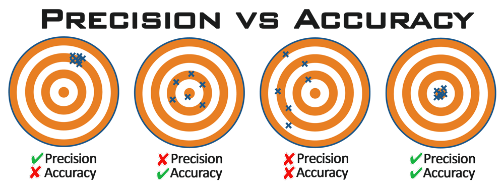

```{r setup, include=FALSE}
knitr::opts_chunk$set(echo = FALSE)

library(tidyverse)
library(here)
```


# About the course

## Context
This course is part of a cluster on quantitative methods (taught mostly in R) at the Department of Sociology. The cluster on quantitative methods is under development. We plan that it is all taught in English. 

- Clusters are designed to facilitate specialization. 
- There is always one core course in each cluster and a few complementary courses. 

## Cluster on quantitative methods:

Already taught:

- Introduction to data analysis in R (recommended first)
- **Applied regression in R** (this course, CORE)

Planned: 

- Generalized linear models in R
- Automated data collection and quantitative text analysis in R
- Social network analysis in R
- Statistical modeling for network data in R
- Design and evaluation of experimental studies

## Proposition

This course (as well as the entire cluster) is designed to be suitable for social scientists and their needs. 

- conceptual understanding and practical skills 
- little math (but we provide reference to relevant literature)

## Goals

After this course, students should:

- have a good conceptual understanding of linear regression and its various purposes
- command related terminology
- understand related assumptions, when they are relevant, how they can be checked, and how problems with assumptions can be treated 
- make well-argued and defensible decisions when conducting their own regression analysis
- conduct regression analysis and report result and diagnostics in tables and charts

## Materials

- The course syllabus can found in the Student Information System [HERE](https://is.cuni.cz/studium/predmety/index.php?id=9638927780309b18b9e8f2d1c9c0e203&tid=&do=predmet&kod=ASGV00995) 
- This course has a dedicated webpage with course materials, homework, assignment details, and slides at <http://enter-link-to-webpage.com>

## About us

XXXXXXXXX Chceme sem dát nějaký medailonek, nebo treba jen foto a prostě se nějak představíme?
  
# Introduction to linear regression

## Goals for today

- Different usage of regression analysis
- Basic concepts (some, more will follow across the course)

## What is linear regression?

<div class="columns-2">

"Linear approach to modeling the relationship between a scalar response and one or more explanatory variables (also known as dependent and independent variables / predictors)." (Wikipedia)

(Note: Scalar is a variable the value of which is fully determined by a single figure in given units.)

<div>

```{r anonymous regression, message=FALSE, warning=FALSE, fig.width=5}

countries <- read.csv(here("data", "countries.csv"))

countries %>%
  ggplot(aes(x= dem_index, y = life_exp)) +
  geom_point()+
  geom_smooth(method = "lm", se = FALSE) +
  labs(x = "predictor variabel on x axis\nhere: democratic index 1-10",
       y = "response variable on y axis\nhere: life expectancy") 

  
```

</div>

## Multivariate linear regression

More than one predictor.

## List of all the things regression does: 

- Detect linear regularities in given data

## So you had better be sure the relationship really is linear...

```{r anscombe, message=FALSE}

dat <- datasets::anscombe
datLong <- data.frame(
    group  = rep(1:4, each = 11),
    x = unlist(dat[,c(1:4)]),
    y = unlist(dat[,c(5:8)])
    )
rownames(datLong) <- NULL

datLong %>% 
  ggplot(aes(x=x, y=y))+
  geom_point()+
  geom_smooth(method = "lm", se = FALSE, fullrange = TRUE)+
  facet_wrap(~group)+
  labs(caption = "Anscombe quartet")

```

## So it does just the one thing, but it is used for many things

1. Descriptive modeling
2. Sample-to-population inference modeling
3. Predictive modeling
4. Causal inference modeling (aka explanatory modeling)


Computationally, all of these are still the same regression. But our different goals with regression have important implications for our assumptions and for what we report. 

# Different purposes of modeling

## Descriptive modeling

- Goal: Summarizing or representing the data structure in a compact manner (capturing association)
- Focus on the measurable level (properties of the actually observed data)
- Few assumptions (but it is useful to check for non-linearity, remember Anscombe)

## Sample-to-population inference modeling

- Goal: Inferring form a sample properties of a population (too large to observe as a whole) 
- Assumption that the data are sampled from a larger population

## Causal inference / explanatory modeling

- Strong role of theory (the theory (not the data) justifies causality)
- Explanatory goals are related to the concept of truth: understand the underlying causal process, the true model
- The worst fear of explanatory modeling: bias (to be systematically wrong, invalid)

## Predictive modeling

- Predicting new or future observations
- Rare in social science academic papers
- Important in business, but also some other disciplines (epidemiology)
- Theory often less important, or not at all (data mining, machine learning)
- "Applied science" (practicality) as opposed to "Basic science"
- The worst fear of predictive modeling: large estimation variance (uncertainty)


## Summary on different types of modeling

- Descriptive modeling is about association(s): when using linear regression, check linearity of the association
- Sample-to-population inference modeling also makes use of confidence intervals and statistical hypothesis testing (and related assumptions), it is also important how the data was collected
- Explanatory and predictive modeling will be further contrasted against each other (while not incompatible, they are different strategies)


## Summary comparison of predictive and explanatory modeling 1/3

                        Explanatory                     Predictive     
------                  -----------                     ----------
Goal                    Explanation                     Prediction
Amount of data          Enough (statistical power)      As much as possible       
Design                  RCT as gold standard            Observational data with noise can be better
Design in multilevel    More groups preferred           More observations per group preferred 
Operationalization      More flexibility                Should be the same for training and predicting


## Summary comparison of predictive and explanatory modeling 2/3


                        Explanatory                     Predictive     
------                  -----------                     ----------
Measurement             Instrument validity (FA, IRT)   Measurement quality
Missing data            Drop cases or imputation        Cannot be dropped, possibly reduced models used
Data preparation        Partitioning rare               Partitioning common practice
EDA                     Theory driven                   Freestyle, interactivity 
Dimension reduction     Interpretability (eg. rotation) Freestyle


## Summary comparison of predictive and explanatory modeling 3/3


                        Explanatory                     Predictive     
------                  -----------                     ----------
Choose variables        Defined by causal structure     Freestyle (eg. interaction without main effect OK)
Choose methods          Model with explicit functions   Also algorithmic (neural networks, ensembles,...)       
Validation              Model fit, residual diagnostics Overfitting
Reporting               Inference                       Comparison across models in terms of predicting


___




<font size="1">Source: https://flyingdonv.com/2016/03/07/get-your-geek-on-accuracy-precision-and-resolution-whats-the-difference-1/</font>


## Conclusions on modeling approaches

- explanatory modeling focuses on causation, is theory-driven, retrospective, and its priority is minimizing bias
- predictive modeling focuses on prediction, is data-driven (interpretability is not neccessary for good predictions), prospective (practicality), and can accept some bias when this reduces variance (i.e. uncertainty)
- explanatory modeling is more developed within the field of statistics, predictive modeling within computer science

## What Shmueli (2010) thinks

- Predictive modeling should be used more in science because it can
  - Generating new hypotheses about causal mechanisms (theory-free exploration)
  - Help assess usefulness of explanatory theories for practical application
- In addition, understanding predictability also means understanding un-predictability, which is theoretically important (e.g. Taleb, 2007)

"An explanatory model that is close to the predictive benchmark may suggest that our understanding of that phenomenon can only be increased
marginally. On the other hand, an explanatory model that is very far from
the predictive benchmark would imply that there are substantial practical
and theoretical gains to be had from further scientific development." (Shmueli, 2010)

Note that the authors of Regression and Other Stories frame all statistical inference as problems of prediction. Words are often used differently...

# Linear regression: some basic building blocks

## Bivariate linear regression formula: y = α + βx

<div class="columns-2">

- α, sometimes also β0, is the intercept, i.e. the value of Y when X = 0
- β, sometimes also β1, is the slope, i.e. rate of change in Y when X changes by 1 unit


<div>


<font size="1">Source: http://www.sthda.com/english/articles/40-regression-analysis/167-simple-linear-regression-in-r/</font>
</div>

## The line and the points

<div class="columns-2">

- The formula y = α + βx represents the line
- But the observed value of Y is usually below or above the line... "the stochastic nature of the dependent variable"
- Assumption: randomness in the real World
- For convenience in regression: X fixed, Y stochastic
- The actual value of Y = linear model + stochastic error term 
- Y = α + βx + ε

<div>


<font size="1">Source: http://www.sthda.com/english/articles/40-regression-analysis/167-simple-linear-regression-in-r/</font>
</div>


## Error vs. Residual

- Error = difference between the real value of Y and the real average value of Y for given X
- Residual = difference between our observed value of Y and our regression model


In other words, errors are the deviations of the theoretical (i.e. measured without measurement error) observations from the real population conditional mean. Residuals are the deviations of the actual observations we have from the sample conditional mean. Or in other words: observable estimates of the unobservable stochastic errors.


## Ordinary least square (OLS)

- Another name for linear regression
- The model is estimated by minimizing the sum of squares of residuals (RSS). This by definition results in having a sum of residuals equal 0.

## Not used

- Different paradigms: 
  - Classical statistics, Error statistics, NHT, Frequentist approach (probability of data given hypothesis)
  - Bayesian inference (probability of hypothesis given data and prior belief)
  - (Maximum likelihood estimation; AIC based inference for model selection)
