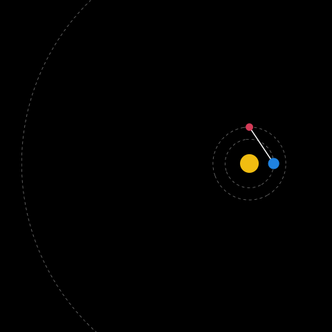

```{r setup, include=FALSE}
knitr::opts_chunk$set(echo = FALSE, warning = FALSE, message = FALSE)


library(dagitty)
library(ggdag)
library(tidyverse)

countries <- read.csv("../data/countries.csv")
```

## Goals for today

- Understand goals of various regression models
- Learn ho to select variables for explanative modeling

## Previously on Applied Regression in R

```{r anonymous-regression, message=FALSE, warning=FALSE, fig.width=4.5}

countries %>%
  ggplot(aes(x= dem_index, y = life_exp)) +
  geom_point()+
  geom_smooth(method = "lm", se = FALSE) +
  labs(x = "predictor variabel on x axis\nhere: democratic index 1-10",
       y = "response variable on y axis\nhere: life expectancy") 

  
```

## What is Regression good for?

<blockquote>
*If you wish to make an apple pie from scratch, you must first invent the universe.*

- Carl Sagan
</blockquote>


## Backpedalling Mars?


## Ptolemaic model


## Copernicus



# To Explain or To Predict?

## To Explain or To Predict?

<div style="float: left; width: 48%; background-color: #ececec;">
<p style="text-align:center">**Predictive models**</p>

- Predicting the future (or the past!)
- Interpretation less important.
- Goal: estimate (unseen) observations as best as possible.
</div>

<div style="float: right; width: 48%; background-color: #ececec;">
<p style="text-align:center">**Explanative (causal) models**</p>

- Explaining workings of the universe.
- Predictive power less important.
- Goal: Estimate model parameters as best as possible.
</div>

## To Explain or To Predict?

- Other differences include: choosing variable, evaluating model fit, choosing sample sizes and more...

- For more details, see: Shmueli, G. (2010). **To Explain or To Predict?** (SSRN Scholarly Paper ID 1351252). Social Science Research Network. https://doi.org/10.2139/ssrn.1351252

## Other uses of regression models

<div style="float: left; width: 48%; background-color: #ececec;">
<p style="text-align:center">**Descriptive Models**</p>

- Basicaly just a math summarization
- Goal: Summarize structure of the data
</div>

<div style="float: right; width: 48%; background-color: #ececec;">
<p style="text-align: center">**Inferential models**</p>

- Sample to population inference
- Goal: Describe population as best as possible
</div>

## What can regression be used for?

- **Predictive models**: Which people are going to vote?
- **Explanative models**: What is the effect of age on voter turnout?
- **Descriptive models**: What is the relationship between age and voter turnout?
- **Inferential models**: How many people are going to vote?

<br>

- Which model are you aiming for?

- We are going to be mainly interested in explanative models.


# Variable selection

## Variable selection

- A researcher is interested in the relationship between intelligence and work self-discipline among adults, but is short on funding.

- Their collegue suggests using university students as their sample.

<br>

- Is this a valid design decision?

## Variable selection

- Goal of analysis matters

<div style="float: left; width: 48%; background-color: #ececec;">
<p style="text-align:center">**Predictive models**</p>

- Goal: Estimate unseen observations as best as possible.

- Training vs testing set, crossvalidation
</div>

<div style="float: right; width: 48%; background-color: #ececec;">
<p style="text-align:center">**Explanative models**</p>

- Goal: Estimate model parameters as best as possible.


- Adjusting for interfering variables, randomization, DAGs

</div>

## Directed acyclic graphs

- Some fields can rely on randomization of treatment (e.g. drug testing). Social sciences generally can't.

- Strong focus on theory, with help of Directed Acyclic Graphs.


```{r dag-example, fig.cap="DAG example", fig.height=3}
dagify(y ~ x + z,
       x ~ z) %>% 
  ggdag(layout = "circle") +
  theme_void()
```


## Knowledge and vaccination rates

Does increasing **knowledge about Covid** raise the **probability a person gets vaccinated**?

```{r dag-minimal, fig.cap="Knowledge leads to behavior?", fig.height=3}

dagify(y ~ x,
       labels = c(y = "Vaccination\nProbability", x = "Covid\nKnowledge"),
       coords = list(x = c(y = 2, x = 1),
                     y = c(y = 1, x = 1)))  %>% 
  ggplot(aes(x = x, xend = xend, y = y, yend = yend)) +
  geom_dag_point() +
  geom_text(aes(label = label), nudge_y = 0.05) +
  geom_dag_edges() +
  scale_y_continuous(limits = c(0.9,1.1)) +
  annotate(geom = "text", x = 1.5, y = 1.04, label = "?", size = 10) +
  theme_dag() 
```

## Interfering variables

- What if we only have cross-sectional data?

<br>

- Should we control for:
    - Socio-economic status?
    - past hospitalization?
    - Percieved threat?

## Types of interfering variables {.smaller}

- 4 types of interfering variables:
    - Confounders (common parent)
    - Colliders (common child)
    - Mediators
    - Moderators

```{r, fig.width=8.6, fig.height=3.5}

dag_field <- dagify(y ~ x,
       labels = c(y = "Vaccination\nProbability", x = "Covid\nKnowledge"),
       coords = list(x = c(y = 2, x = 1),
                     y = c(y = 1, x = 1))) %>% 
  tidy_dagitty()

bind_rows(dag_field$data,
          tibble(name = c("w", "z", "q"),
       x    = c(1.2,1.4,1.7),
       y    = c(1.04,0.92,1.04),
       label = c("Socio-econ. status",
                 "Past hospitalization",
                 "Perceived threat"))) %>% 
  ggplot(aes(x = x, xend = xend, y = y, yend = yend)) +
  geom_dag_point() +
  geom_text(aes(label = label), nudge_y = 0.03) +
  geom_dag_edges() +
  scale_y_continuous(limits = c(0.9,1.1)) +
  annotate(geom = "text", x = 1.5, y = 1.04, label = "?", size = 10) +
  theme_dag() 
```

## Confounders

- Assume socio-econ. status raises knowledge about Covid *and* also raises vaccination probability.
- What does is it mean for the estimate of *knowledge* -> *vaccination*?

```{r confounder-example, fig.height=4}

dagify(y ~ x + z,
       x ~ z,
       labels = c(y = "Vaccination\nProbability", x = "Covid\nKnowledge",
                  z = "Socio-econ. status"),
       coords = list(x = c(y = 2, x = 1, z = 1.5),
                     y = c(y = 1, x = 1, z = 1.05))) %>% 
  ggplot(aes(x = x, xend = xend, y = y, yend = yend)) +
  geom_dag_point() +
  geom_text(aes(label = label), nudge_y = 0.03) +
  geom_dag_edges() +
  scale_y_continuous(limits = c(0.9,1.1)) +
  theme_dag() 
```

## Colliders

- Assume Covid knowledge lowers probability of hospitalization and at the same time, vaccination lowers probability of hospitalization.
- What does is it mean for the estimate of *knowledge* -> *vaccination*?

```{r collider-example, fig.height=4}
dagify(y ~ x + z,
       z ~ y + x,
       labels = c(y = "Vaccination\nProbability", x = "Covid\nKnowledge",
                  z = "Hospitalization"),
       coords = list(x = c(y = 2, x = 1, z = 1.5),
                     y = c(y = 1, x = 1, z = 0.95))) %>% 
  ggplot(aes(x = x, xend = xend, y = y, yend = yend)) +
  geom_dag_point() +
  geom_text(aes(label = label), nudge_y = 0.03) +
  geom_dag_edges() +
  scale_y_continuous(limits = c(0.9,1.1)) +
  theme_dag() 
```

## Colliders - die example

- Two 6 sided die, fair, independent.
- Can you tell outcome of the second dice based on outcome of the first one?

```{r, fig.height=3}
tibble(x = 1:3,
       y = rep(1),
       throw = paste("Throw", 1:3),
       delim = rep("--------"),
       dice1 = c("Dice 1 = 2", "Dice 1 = 3", "Dice 1 = 4"),
       dice2 = rep("Dice 2 = ?")) %>% 
  ggplot() +
  geom_text(aes(x = x, y = y + 0.009, label = throw), size = 10) +
  geom_text(aes(x = x, y = y + 0.0045, label = delim), size = 10) +
  geom_text(aes(x = x, y = y, label = dice1), size = 10) +
  geom_text(aes(x = x, y = y - 0.009, label = dice2), size = 10) +
  scale_x_continuous(limits = c(0.5, 3.5)) +
  scale_y_continuous(limits = c(0.975, 1.025)) +
  theme_void()
```

## Colliders - die example

- Two 6 sided die, fair, independent.
- But this time, we know the total.


```{r, fig.height=3}
tibble(x = 1:3,
       y = rep(1),
       throw = paste("Throw", 1:3),
       delim = rep("--------"),
       dice1 = c("Dice 1 = 2", "Dice 1 = 3", "Dice 1 = 4"),
       dice2 = rep("Dice 2 = ?"),
       total = rep("Total = 6")) %>% 
  ggplot() +
  geom_text(aes(x = x, y = y + 0.009, label = throw), size = 10) +
  geom_text(aes(x = x, y = y + 0.0045, label = delim), size = 10) +
  geom_text(aes(x = x, y = y, label = dice1), size = 10) +
  geom_text(aes(x = x, y = y - 0.01, label = dice2), size = 10) +
  geom_text(aes(x = x, y = y - 0.015, label = delim), size = 10) +
  geom_text(aes(x = x, y = y - 0.02, label = total), size = 10) +
  scale_x_continuous(limits = c(0.5, 3.5)) +
  scale_y_continuous(limits = c(0.975, 1.025)) +
  theme_void()
```

## Colliders - die example

- Conditioning on / controlling for colliders creates artificial relationships.


```{r, fig.height=3}
tibble(x = 1:3,
       y = rep(1),
       throw = paste("Throw", 1:3),
       delim = rep("--------"),
       dice1 = c("Dice 1 = 2", "Dice 1 = 3", "Dice 1 = 4"),
       dice2 = c("Dice 2 = 4", "Dice 2 = 3", "Dice 2 = 2"),
       total = rep("Total = 6")) %>% 
  ggplot() +
  geom_text(aes(x = x, y = y + 0.009, label = throw), size = 10) +
  geom_text(aes(x = x, y = y + 0.0045, label = delim), size = 10) +
  geom_text(aes(x = x, y = y, label = dice1), size = 10, color = "olivedrab") +
  geom_text(aes(x = x, y = y - 0.01, label = dice2), size = 10, color = "tomato") +
  geom_text(aes(x = x, y = y - 0.015, label = delim), size = 10) +
  geom_text(aes(x = x, y = y - 0.02, label = total), size = 10) +
  scale_x_continuous(limits = c(0.5, 3.5)) +
  scale_y_continuous(limits = c(0.975, 1.025)) +
  theme_void()
```

## Colliders

```{r}
set.seed(1234)
colliders_sim <- 
tibble(knowledge = rnorm(n = 1000),
       vaccination = 0.05* knowledge + rnorm(n = 1000, mean = 0.5, sd = 0.1),
       hosp = - 1*knowledge - 4*vaccination,
       prob = exp(hosp) / (1 + exp(hosp)),
       group = ifelse(prob > 0.5, "hospitalized", "not hospitalized"))

colliders_sim %>% 
  ggplot(aes(x = knowledge, y = vaccination, color = group)) +
  geom_vline(xintercept = 0, linetype = "dashed", color = "grey80") +
  geom_hline(yintercept = 0.5, linetype = "dashed", color = "grey80") +
  geom_point(alpha = 0.5) +
  geom_abline(slope = 0.05, intercept = 0.5, size = 1, linetype = "dashed", color = "grey60") +
  geom_smooth(aes(group = 1), method = "lm", se = F, color = "green4") +
  geom_smooth(data = filter(colliders_sim, group == "hospitalized"),
              method = "lm", se = F, fullrange = T) +
  annotate(geom = "text", x = 2, y = 0.23, label = "Only hospitalized", color = "tomato") +
  annotate(geom = "curve", x = 2, xend = 1.8, y = 0.2, yend = 0.15,
           arrow = arrow(length=unit(0.20,"cm")), color = "tomato") +
  annotate(geom = "text", x = 3, y = 0.85, label = "All people", color = "green4") +
  annotate(geom = "curve", x = 3, xend = 2.8, y = 0.82, yend = 0.67,
           arrow = arrow(length=unit(0.20,"cm")), color = "green4") +
  scale_color_manual(values = c("tomato", "black")) +
  labs(color = element_blank(),
       caption = "Simulated data") +
  theme_classic() +
  theme(legend.position = "bottom")
```

## Colliders

- We should never condition on colliders.

```{r collider-example-electric-boogaloo, fig.height=4}
dagify(y ~ x + z,
       z ~ y + x,
       labels = c(y = "Vaccination\nProbability", x = "Covid\nKnowledge",
                  z = "Hospitalization"),
       coords = list(x = c(y = 2, x = 1, z = 1.5),
                     y = c(y = 1, x = 1, z = 0.95))) %>% 
  ggplot(aes(x = x, xend = xend, y = y, yend = yend)) +
  geom_dag_point() +
  geom_text(aes(label = label), nudge_y = 0.03) +
  geom_dag_edges() +
  scale_y_continuous(limits = c(0.9,1.1)) +
  theme_dag() 
```

## Mediators

- How could Covid knowledge influence vaccination probability?
- Perhaps by raising the perceived threat of health problems?
- Presence of mediators changes interpretation of regression coefficients!

```{r mediators-example, fig.cap=3}
dagify(y ~ x + z,
       z ~  x,
       labels = c(y = "Vaccination\nProbability", x = "Covid\nKnowledge",
                  z = "Perceived threat"),
       coords = list(x = c(y = 2, x = 1, z = 1.5),
                     y = c(y = 1, x = 1, z = 0.95))) %>% 
  ggplot(aes(x = x, xend = xend, y = y, yend = yend)) +
  geom_dag_point() +
  geom_text(aes(label = label), nudge_y = 0.03) +
  geom_dag_edges() +
  scale_y_continuous(limits = c(0.9,1.1)) +
  theme_dag() 
```

## Moderators

- What if the relationships between Covid knowledge and vaccination probability changes based on where people live?
- Moderators are interactions. Without them, we get an average effect.

```{r moderators-example, fig.cap=3}
dagify(y ~ x,
       labels = c(y = "Vaccination\nProbability", x = "Covid\nKnowledge"),
       coords = list(x = c(y = 2, x = 1),
                     y = c(y = 1, x = 1))) %>% 
  ggplot(aes(x = x, xend = xend, y = y, yend = yend)) +
  geom_dag_point() +
  geom_text(aes(label = label), nudge_y = 0.03) +
  geom_dag_edges() +
  annotate(geom = "point", x = 1.5, y = 1.05, size = 16) +
  annotate(geom = "segment", x = 1.5, xend = 1.5, y = 1.03, yend = 1.01,
           arrow = arrow(length=unit(0.20,"cm"), type = "closed")) +
  annotate(geom = "text", x = 1.5, y = 1.08, label = "Region of living") +
  scale_y_continuous(limits = c(0.9,1.1)) +
  theme_dag() 
```

## The final DAG

```{r dag-final, fig.height=6, fig.width=7}
dagify(y ~ x + z + q ,
       x ~ z,
       q ~ x,
       w ~ y + x,
       labels = c(y = "Vaccination\nProbability", x = "Covid\nKnowledge",
                  z = "Soc-econ. status", q = "Perceived threat", w = "Hospitalization"),
       coords = list(x = c(y = 2, x = 1, z = 1.5, w = 1.5, q = 1.5),
                     y = c(y = 1, x = 1, z = 1.15, w = 0.85, q = 0.94))) %>% 
  ggplot(aes(x = x, xend = xend, y = y, yend = yend)) +
  geom_dag_point() +
  geom_text(aes(label = label), nudge_y = 0.04) +
  geom_dag_edges() +
  annotate(geom = "point", x = 1.5, y = 1.05, size = 16) +
  annotate(geom = "segment", x = 1.5, xend = 1.5, y = 1.03, yend = 1.01,
           arrow = arrow(length=unit(0.20,"cm"), type = "closed")) +
  annotate(geom = "text", x = 1.5, y = 1.08, label = "Region of living") +
  scale_y_continuous(limits = c(0.8,1.2)) +
  annotate(geom = "text", x = 1.68, y = 1.16, label = "Always control\nfor confounders!",
           color = "green4") +
  annotate(geom = "text", x = 1.68, y = 0.84, label = "Never control\nfor colliders >:(",
           color = "tomato") +
  annotate(geom = "text", x = 1.15, y = 1.15,
           label = "Add moderator if you\nare interested\nin subpopulations", color = "mediumblue") +
  annotate(geom = "curve", x = 1.15, xend = 1.45, y = 1.12, yend = 1.05,
           arrow = arrow(length=unit(0.20,"cm")), color = "mediumblue") +
  annotate(geom = "text", x = 1.15, y = 0.88,
           label = "Control for mediator\nif you want to filter it out",
           color = "mediumblue") +
  annotate(geom = "curve", x = 1.28, xend = 1.45, y = 0.88, yend = 0.92,
           arrow = arrow(length=unit(0.20,"cm")), color = "mediumblue",
           curvature = .1) +
  theme_dag() 

```

## Variable selection

- A researcher is interested in the relationship between intelligence and work self-discipline among adults, but is short on funding.

- Their collegue suggests using university students as their sample.

<br>

- Is this a valid design decision?