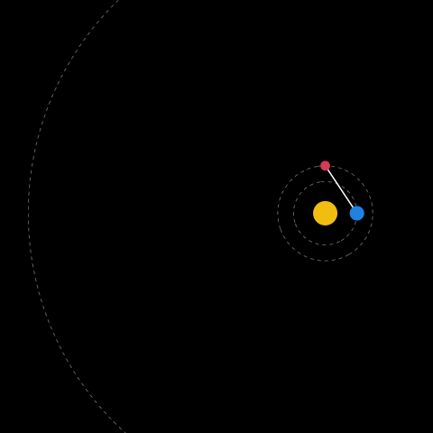

```{r setup, include=FALSE}
knitr::opts_chunk$set(echo = FALSE)


library(dagitty)
library(ggdag)
library(tidyverse)

countries <- read.csv("../data/countries.csv")
```

## Goals for today

- Understand goals of various regression models
- Learn ho to select variables for explanative modeling

## Previously on Applied Regression in R

```{r anonymous-regression, message=FALSE, warning=FALSE, fig.width=4.5}

countries %>%
  ggplot(aes(x= dem_index, y = life_exp)) +
  geom_point()+
  geom_smooth(method = "lm", se = FALSE) +
  labs(x = "predictor variabel on x axis\nhere: democratic index 1-10",
       y = "response variable on y axis\nhere: life expectancy") 

  
```

## What is Regression good for?

<blockquote>
*If you wish to make an apple pie from scratch, you must first invent the universe.*

- Carl Sagan
</blockquote>


## Backpedalling Mars?


## Ptolemaic model


## Copernicus



# To Explain or To Predict?

## To Explain or To Predict?

<div style="float: left; width: 48%; background-color: #ececec;">
<p style="text-align:center">**Predictive models**</p>

- Predicting the future (or the past!)
- Interpretation less important.
- Goal: estimate (unseen) observations as best as possible.
</div>

<div style="float: right; width: 48%; background-color: #ececec;">
<p style="text-align:center">**Explanative (causal) models**</p>

- Explaining workings of the universe.
- Predictive power less important.
- Goal: Estimate model parameters as best as possible.
</div>

## To Explain or To Predict?

- Other differences include: choosing variable, evaluating model fit, choosing sample sizes and more...

- For more details, see: Shmueli, G. (2010). **To Explain or To Predict?** (SSRN Scholarly Paper ID 1351252). Social Science Research Network. https://doi.org/10.2139/ssrn.1351252

## Other uses of regression models

<div style="float: left; width: 48%; background-color: #ececec;">
<p style="text-align:center">**Descriptive Models**</p>

- Basicaly just a math summarization
- Goal: Summarize structure of the data
</div>

<div style="float: right; width: 48%; background-color: #ececec;">
<p style="text-align: center">**Inferential models**</p>

- Sample to population inference
- Goal: Describe population as best as possible
</div>

## What can regression be used for?

- **Predictive models**: Which people are going to vote?
- **Explanative models**: What is the effect of age on voter turnout?
- **Descriptive models**: What is the relationship between age and voter turnout?
- **Inferential models**: How many people are going to vote?

<br>

- Which model are you aiming for?

- We are going to be mainly interested in explanative models.


# Variable selection

## Variable selection

- A researcher is interested in the relationship between intelligence and work self-discipline among adults, but is short on funding.

- Their collegue suggests using university students as their sample.

<br>

- Is this a valid design decision?

## Variable selection

- Goal of analysis matters

<div style="float: left; width: 48%; background-color: #ececec;">
<p style="text-align:center">**Predictive models**</p>

- Goal: Estimate unseen observations as best as possible.

- Training vs testing set, crossvalidation
</div>

<div style="float: right; width: 48%; background-color: #ececec;">
<p style="text-align:center">**Explanative models**</p>

- Goal: Estimate model parameters as best as possible.


- Adjusting for interferring variables, randomization, DAGs

</div>

## Directed acyclic graphs

- Some fields can rely on randomization of treatmeant (e.g. drug testing). Social sciences generally can't.

- Strong focus on theory, with help of Directed Acyclic Graphs.


```{r dag-example, fig.cap="DAG example", fig.height=3}
dagify(y ~ x + z,
       x ~ z) %>% 
  ggdag(layout = "circle") +
  theme_void()
```


## Knowledge and vaccination rates

Does increasing **knowledge about vaccines** raise the **probability a person gets vaccinated**?

<br>

- Should we control for:
    - socio-economic status?
    - trust in public institutions?
    - past hospitalization?

<br>

- What if we only have cross-sectional data?

## Types of interfering variables

- We need to thing about 4 types of interfering variables
    - Confounders (common parent)
    - Colliders (common child)
    - Mediators
    - Moderators

