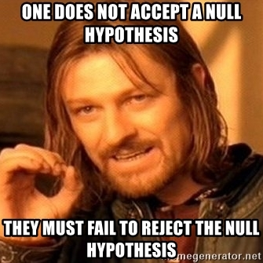

```{r setup, include=FALSE}
knitr::opts_chunk$set(echo = FALSE)

library(tidyverse)
library(here)
library(polynom)
library(patchwork)

countries <- read.csv(here("data", "countries.csv"))
```

## Goals for today

-   Quick recap on some basic concepts in statistics
-   Basic concepts and building block for regression analysis
-   Building and interpreting simple linear regression in R (yay, we are gonna work in R!)
-   Centering variables for better interpretation

# Recap on selected concepts in statistics

## Probability distribution


<font size="1">Source: [@gelman2020, pp. 41]</font>

For each distribution of a variable z, we can calculate the mean, a.k.a. the expected value written as E(z) or μ~z~ to refer specifically to population mean or $\overline{x}$ to refer to sample mean.

## The variance of distribution

Variance = expected value of the squared deviation from the mean.

Var = E[(z − μ~z~ )^2^]

We typically work with the standard deviation rather than the variance because it is on the original scale of the distribution.

σ~z~ = sqrt(Var)

## Visual representation is often preferred to understand variability in the variable

```{r}

x = rnorm(100) - 1 
names(x) = rep("x", 100)
y = rnorm(100) + 1
names(y) = rep("y", 100)
z = c(x,y)

data = data.frame(origin=names(z), value=z, row.names=NULL)


p1 <- data %>% ggplot(aes(x=z))+geom_histogram(bins = 20, color="white") + labs(title = "Histogram")
p2 <- data %>% ggplot(aes(x=z))+geom_density(fill="grey") + labs(title = "Density plot")
p3 <- data %>% ggplot(aes(y=z, x=""))+geom_boxplot() + labs(x = "") + labs(title = "Box plot")
p4 <- data %>% ggplot(aes(y=z, x=""))+geom_violin()+geom_boxplot(width=0.4) + labs(x = "") + labs(title = "Violin plot")

(p1 | p2 ) / (p3 | p4 )

```

## Sampling distribution 1/2

"The sampling distribution is the set of possible datasets that could have been observed if the data collection process had been re-done, ..." [@gelman2020, pp. 50]

-   In modeling, we work with estimates (sample mean, sample regression coefficients, i.e. betas etc.) (we expect estimates to be different for each sample, i.e. they come from a distribution with some variance).
-   BUT we only have one sample from the sampling distribution! No variation! We need to estimate (or conceptualize) it from the observed data. (For regression coefficients, this is where assumptions kick in, we will talk about it later.)

## Sampling distribution 2/2

-   Standard deviation of the distribution of a given estimate is called standard error = σ/sqrt(N). Confidence intervals are extension of standard errors, see picture below (beta-hat is the estimate of the regression coefficient beta from the data).
-   P-value: for a t-test of estimates where H0: estimate = 0

::: {.centered}


<font size="1">Source: [@gelman2020, pp. 51]</font>
:::

## T-distribution (used for statistical significance testing of estimates)

-   Similar to normal (symmetric), but heavier tails, three parameters: center, scale, degrees of freedom

## Statistical significance and hypothesis testing

-   conventional wisdom: statistical significance is p-value less than 0.05, relative to some null hypothesis (hypothesis of no difference / no effect)
-   intuition behind it: an estimate is said to be NOT statistically significant if the observed value could reasonably be explained by chance

## Null-hypothesis testing (NHT)

-   null hypothesis: estimate = 0
-   alternative hypothesis: estimate != 0
-   p-value: "the probability under a specified statistical model that a statistical summary of the data (e.g., the sample mean difference between two compared groups) would be equal to or more extreme than its observed value" [@wasserstein2016, pp.]

## Type 1 and type 2 error in NHT

::: {.centered}
```{r out.width = "50%", echo=FALSE}

knitr::include_graphics(here("images","type_1and2_errors.png"))
```

<font size="1">Source <https://www.researchgate.net/figure/Graphical-representation-of-type-1-and-type-2-errors_fig1_268035363></font>
:::

-   type 1 error: the probability of falsely rejecting a null hypothesis, if it is in fact true
-   type 2 error: the probability of not rejecting a null hypothesis that is in fact false

------------------------------------------------------------------------

::: {.centered}

:::

## Critique of NHT 1/3

-   NH is unrealistic in social sciences (only a matter of sample size)
-   NH is theoretically uninteresting (effect size and variations of effect sizes in different groups is)
-   NH is a very low threshold - non-rejection tells us that there is not even enough information in the data to move beyond the banal null hypothesis
-   Even statistically non-significant data can carry important information (not just for meta-analysis)

## Critique of NHT 2/3

-   p-value is often used as a license for making a claim of a scientific finding (or implied truth) while neglecting many other important considerations ("design of a study, the quality of the measurements, the external evidence for the phenomenon under study, and the validity of assumptions that underlie the data analysis" [@wasserstein2016]
-   p-value is often used incorrectly (significance chasing a.k.a. p-hacking): (1) multiple statistical tests, (2) choice of data to be presented based on statistical-significance result
-   p-value is often interpreted incorrectly (such as when non-significant p-value is considered evidence for no difference)
-   there is (usually almost) no difference between 5.1% and 4.9% significance level

## Critique of NHT 3/3

See the ASA statement which links to plenty of other relevant literature on p-value [@wasserstein2016]

## Covariance

Measure of joint variability in a linear relationship between two variables.

Var(x) = E[(x − μ~x~ )^2^] = E[(x − μ~x~ )\*(x − μ~x~ )]

Cov(x,y) = E[(x − μ~x~ )\*(y − μ~y~ )]

## Visual representation to understand association between two variables

```{r warning=FALSE, message=FALSE}

p1 <- countries %>% ggplot(aes(x=uni_prc, y=life_exp))+
  geom_point()+
  labs(x="",
       y="life expectancy")

p2 <- countries %>% ggplot(aes(x=uni_prc, y=life_exp))+
  geom_smooth(method = "lm", se=FALSE)+
  labs(x="",
       y="")

p3 <- countries %>% ggplot(aes(x=uni_prc, y=life_exp))+
  geom_point()+
  geom_smooth(method = "lm", se=FALSE)+
  labs(x="percentage of people with university degree",
       y="life expectancy")

p4 <- countries %>% ggplot(aes(x=uni_prc, y=life_exp))+
  geom_point()+
  geom_smooth()+
  labs(x="percentage of people with university degree",
       y="")


patchwork <- (p1 | p2 ) / (p3 | p4 )

patchwork +   plot_annotation(title = 'Association between university education and life expectancy in selected countries')

```

## The value of covariance is rarely useful as the end product

For a set of selected countries:

```{r comment='>'}
cat(paste0("The covariance of life expectancy and proportion of university degree is ", cov(countries$life_exp, countries$uni_prc, use = "complete.obs")))

cat(paste0("The covariance of population and area is ", cov(countries$population, countries$area, use = "complete.obs")))

```

## Correlation is standardized covariance

```{r comment='>'}
cat(paste0("The correlation of life expectancy and proportion of university degree is ", round(cor(countries$life_exp, countries$uni_prc, use = "complete.obs", method = "pearson"),2)))

cat(paste0("The correlation of population and area is ", round(cor(countries$population, countries$area, use = "complete.obs", method = "pearson"),2)))


```

## Visual perception of correlation strength

```{r message=FALSE}
complement <- function(y, rho, x) {
  if (missing(x)) x <- rnorm(length(y)) # Optional: supply a default if `x` is not given
  y.perp <- residuals(lm(x ~ y))
  rho * sd(y.perp) * y + y.perp * sd(y) * sqrt(1 - rho^2)
}

y <- rnorm(50, sd=10)
x <- 1:50 # Optional
rho <- c(0, 0.2, 0.4, 0.6, 0.8, 1)
X <- data.frame(z=as.vector(sapply(rho, function(rho) complement(y, rho, x))),
                rho=ordered(rep(signif(rho, 2), each=length(y))),
                y=rep(y, length(rho)))
    

ggplot(X, aes(y,z, group=rho)) + 
  geom_smooth(method="lm", se=FALSE) + 
  geom_rug(sides="b") + 
  geom_point(aes(fill=rho), alpha=1/2, shape=21) +
  facet_wrap(~ rho)
```

<font size="1"> Code by whuber from: <https://stats.stackexchange.com/questions/15011/generate-a-random-variable-with-a-defined-correlation-to-an-existing-variables></font>

# Linear regression: basic building blocks

## Bivariate linear regression formula: y = α + βx

<div class="columns-2">

-   α, sometimes also β0, is the intercept, i.e. the value of Y when X = 0
-   β, sometimes also β1, is the slope, i.e. rate of change in Y when X changes by 1 unit

<div>


<font size="1">Source: <http://www.sthda.com/english/articles/40-regression-analysis/167-simple-linear-regression-in-r/></font>

</div>

## The difference between correlation and regression coefficient

```{r message=FALSE}
set.seed(42)
edu <- round (rnorm (100, mean = 15, sd = 4), digits=0)
set.seed (24)
rand <- round(rnorm (100, mean = 1000, sd = 50), digits=0)
rand.2 <- round(rnorm (100, mean = 2000, sd = 300), digits=0)
inc <- edu*rand
inc.2 <- edu*rand.2

data <- data.frame(x = edu, y = c(inc, inc.2), group = c(rep(1,100), rep(2,100)), row.names = NULL)

data %>% ggplot(aes(x=x, y=y, color = group, group=group))+
  geom_point()+
  geom_smooth(method = "lm", se=FALSE)+
  labs(title = "Simulated data",
       subtitle = "Light blue population has higher regression coefficient but lower correlation",
       x = "Years of education",
       y = "Monthly income in CZK")+
  theme(legend.position = "none")

```

## The line and the points

<div class="columns-2">

-   The formula y = α + βx represents the line
-   But the observed value of Y is usually below or above the line... "the random nature of the dependent variable"
-   Assumption: randomness in the real World
-   For convenience in regression: X fixed, Y random
-   The actual value of Y = linear model + random error term
-   Y = α + βx + ε

<div>

 <font size="1">Source: <http://www.sthda.com/english/articles/40-regression-analysis/167-simple-linear-regression-in-r/></font>

</div>

## Error vs. Residual

-   Error = difference between the real value of Y and the real average value of Y for given X

-   Residual = difference between our observed value of Y and our regression model

-   In other words, errors are the deviations of the theoretical (i.e. measured without measurement error) observations from the real population conditional mean. Residuals are the deviations of the actual observations we have from the sample conditional mean. Or in other words: observable estimates of the unobservable random errors.

## Ordinary least square (OLS)

<div class="columns-2">

-   Another name for linear regression

-   The model is estimated by minimizing the sum of squares of residuals (RSS). This by definition results in having a sum of residuals equal 0.

-   $\small Sum\:of\:squares=-2^2+1.1^2+\\\small2.8^2+(-4)^2+1.6^2+1.8^2+\\\small(-0.3^2)+(-0.2^2)+\\\small(-0.1^2)+(-0.7^2)=35.3$

-   $\small Sum\:of\:residuals=-2+1.1\\\small+2.8-4+1.6+1.8-0.3\\\small-0.2-0.1-0.7=0$

<div>

```{r, warning=F, message=FALSE, fig.width=5}
set.seed(1234)

ss_df = tibble::tibble(x = 1:10,
                       y = 2 + x + rnorm(n = 10, sd = 2))

ss_mod = lm(y ~ x, data = ss_df)
ss_df$pred = predict(ss_mod)
ss_df$label_pos = ifelse(ss_df$pred < ss_df$y,
                         ss_df$pred + (ss_df$y - ss_df$pred) / 2,
                         ss_df$pred - (ss_df$pred - ss_df$y) / 2)
ss_df$res = ss_df$y - ss_df$pred

ggplot(ss_df,aes(x = x, y = y, label = round(y - pred, 1))) +
  geom_point() +
  geom_smooth(method = "lm", se = F) +
  geom_segment(aes(xend = x, yend = pred, color = "tomato"), show.legend = F) +
  geom_text(aes(x = x, y = label_pos), nudge_x = 0.2, color = "tomato")
  
```

<font size="3">For details on how OLS is calculated, see @fox2015 [pp. 83]</font>

<div>

## Regression and t-test

The line in the model can be perceived as conditional mean (as in the picture below). That is reminiscent of t-test. In fact, simple regression with one binary predictor is equivalent to t-test.

```{r message=FALSE, warning=FALSE}


countries %>% mutate(postsoviet = as.numeric(postsoviet=="yes")) %>% 
  ggplot(aes(x=postsoviet, y = life_exp))+
     stat_summary(fun = mean, geom = "point", shape=20, size=8, color="red", fill="red") + 
    stat_summary(fun.data = mean_se, geom = "errorbar", color = "red", width=0.1, fun.args = list(mult = 2))+
    geom_point(alpha=0.3)+ 
  geom_smooth(method = "lm", se=FALSE)+
  scale_x_continuous(breaks = c(0,1), labels = c("non-postsoviet", "postsoviet"))+
  labs(x = "",
       y = "life expectancy",
       caption = "Red error bars indicate 95% CI of the mean values")
```

## Centering predictors for better interpretation

-   Centering in OLS - interpretation purposes
-   Centering by subtracting the mean: intercept interpreted y when predictor x is set to its mean
-   Using conventional centering point (such as subtracting 100 in IQ)

## Beta-standardized coefficients

-   Used to determine relative weight of independent variables: Effect of an increase in X by one standard deviation on Y, also measured in standard deviations.

    -   Simple: standardize all variables (z-scores).

-   Sometimes better: standardizing by subtracting the mean and dividing by 2 standard deviations (not 1)

    -   Direct comparability with untransformed binary predictors [@gelman2008]

## References
