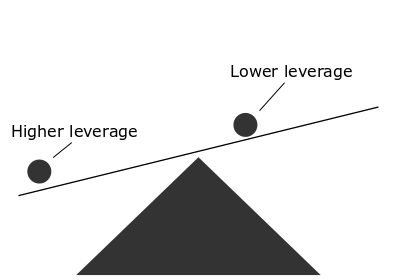

```{r setup, include=FALSE}
library(tidyverse)
library(patchwork)
library(car)

knitr::opts_chunk$set(echo = FALSE)
un = read.table("../data/UnitedNations.txt")
```

## Goals for today

-   Learn about the assumptions of linear regression
-   Learn how to use diagnostic plots
-   Learn about the limitations of statistical tests for assumption checking

## Bias and random error (rehearsal)

-   Total error composed of two parts: bias and random error

<br>

-   Bias - systemic error, i.e. systemic under- or overestimation of the expected values
-   Random error - random deviations from the true value (due to the sampling and measurement error)

<br>

-   Violations of assumptions can increase either or both

## Precision and efficiency

-   Precision

    -   reciprocal to the random error (high precision = low random error)

<br>

-   Efficiency

    -   how many observations we need to achieve a specific level of performance
    -   e.g. model based on data that meet its assumptions require less observations to achieve 80% statistical power, i.e. is more efficient

## How to think about assumptions

> *All models are wrong, but some are useful*. <br>
> - George Box

- No model is perfect picture of reality and that's ok.
- How good the picture is?

## How to think about assumptions

-   Small violations lead to only small error, big ones...

<br>

-   Don't think about assumptions in binary term (*"ok"* vs *"bad"*)
-   Instead, think *how much* we deviate from them

<br>

-   Not all assumption are also important for all tasks

# What are the assumptions?

## Assumptions of linear regression

-   Helpfully sorted by @gelman2020 in order of (general) importance:

    1)  Validity

    2)  Representativeness

    3)  Linearity and additivity

    4)  Independence of errors

    5)  Homoscedasticity of errors

    6)  Normality of errors

## Validity

1)  Are the data we use are sufficient to answer the research question at hand?
2)  Are all traits measured with sufficient quality?
3)  Are data  gathered to so that inference is possible?
4)  Is the model correctly specified?

<br>

-   Violation of this assumption will lead to bias

## Representativeness

-   If our goal is either prediction or inference, our data needs to be a representative sample of the population of interest

-   More specifically, we assume that the distribution of the dependent variable is representative of the population, given the the predictors

## Representativeness

-   Do the data need to be representative in all aspects?

<br>

-   Consider model predicting `income` based on `age`. What happens if our data are not representative?

    -   More specifically, what if only people with above average age/income participate in our survey?

## Representativeness

```{r representativeness-example, message=FALSE, echo=FALSE, warning=FALSE, fig.width=8}
set.seed(12345)
rep_df = tibble(age = rnorm(1000, 40, 10),
                income = 10000 + 100*age + rnorm(100, 0, 1000))
true_df = tibble(age = rnorm(1000, 40, 10),
                income = 10000 + 100*age)

ggplot(data = rep_df, aes(x = age, y = income)) +
  geom_point() +
  geom_smooth(method = "lm", se = F, fullrange = T, aes(color = "Estimated")) +
  geom_smooth(method = "lm", se = F, fullrange = T,aes(color = "True"), data = true_df) +
  labs(color = "Relationship") +
  scale_x_continuous(limits = c(0,80)) +
  scale_y_continuous(limits = c(8000,18000))
```

## Representativeness

```{r representativeness-example2, message=FALSE, echo=FALSE, warning=FALSE, fig.width=8}
con_age_plot = ggplot(data = rep_df[rep_df$age > mean(rep_df$age),], aes(x = age, y = income)) +
  geom_point() +
  geom_smooth(method = "lm", se = F, fullrange = T, aes(color = "Estimated")) +
  geom_smooth(method = "lm", se = F, fullrange = T, data = rep_df, aes(color = "True")) +
  labs(color = "Relationship") +
  scale_x_continuous(limits = c(0,80)) +
  scale_y_continuous(limits = c(8000,18000))

con_income_plot = ggplot(data = rep_df[rep_df$income > mean(rep_df$income),], aes(x = age, y = income)) +
  geom_point() +
  geom_smooth(method = "lm", se = F, fullrange = T, aes(color = "Estimated")) +
    geom_smooth(method = "lm", se = F, fullrange = T, data = rep_df, aes(color = "True")) +
  labs(color = "Relationship") +
  scale_x_continuous(limits = c(0,80)) +
  scale_y_continuous(limits = c(8000,18000))

con_age_plot + con_income_plot + plot_annotation(tag_levels = "A") + plot_layout(guides = "collect") & theme(legend.position = "bottom")
```

-   Estimates even when sample is not representative in age (independent variable).

## Linearity and additivity

- Two ways people talk about linearity:
  - Linearity of relationship between variables
  - Linearity of regression terms

<br>

- What is the difference?

## Linearity of relationships

- Simple, the relationship between variables is a straight line.

```{r}

ggplot(mapping = aes(x = 1:10, y = 1:10)) +
  geom_abline(color = "tomato") +
  labs(y = "Dependent variable",
       x = "Indepdendent variable") +
  theme_classic()
```

## Linearity of forms

-   Linear models are linear, because they assume linear form:

$$
y = \beta_0 + \beta_1*x_1 + \beta_2*x_2\:+\:...\:\beta_p*x_p
$$

<br>

-   No all relationship are neccesary linear though:

$$
y = \beta_0 + (\beta_1*x_1) * (\beta_2*x_2)
$$

<br>

- Model is linear, if the regression coefficients are only either add or subtracted from each other

## Linearity and additivity

-   Some nonlinear models can be translated into linear form using an appropriate transformation:

$$
\beta_0 + log[(\beta_1*x_1) * (\beta_2*x_2)] = \beta_0 + log(\beta_1*x_1) + log(\beta_2*x_2)
$$ <br>

-   Linear models can only capture relationships that fulfill this assumption
-   Violation of this assumption leads to bias

## Linearity and additivity

- We assume that the effects of independent variables can be simply added together.
- Sometimes, this may not be true, e.g. a interaction is needed.

<br>

- Violation of this assumption leads to bias.

## Independence of errors

-   Linear regression assumes that errors are independent of each other.

<br>

-   Often violated due to sampling design, time series and spatial analysis.

<br>

-   Violation of this assumption leads to incorrect estimation of standard error, and therefore presents a risk to inference

## Homoscedasticity (constant variance of errors)

-   Homoscedasticity = variance of residuals is the same for all levels of $Y$
-   If the variance of the errors is not constant, the the error are heteroscedastic.

## Homoscedasticity (constant variance of errors)

```{r homoscedasticity-examples, fig.cap= "Example of A) homoscedastic data B) heteroscedastic data", echo=FALSE, fig.width=10, fig.height=3}

set.seed(1234)

#homodescadistic data
x_const = rnorm(n = 1000)
y_const = rnorm(n = 1000)
plot_homodescadistic = qplot(x = x_const, y = y_const) + labs(x = "Scaled predicted values", y = "Scaled errors")+ geom_hline(yintercept = 0, linetype = "dashed", color = "grey70")

#heterodescadistic data
n=1:1000
eps = rnorm(n,mean=0,sd=sqrt(n^1.3))
y= n + eps
mod <- lm(y ~ n)
plot_heterodescadistic = qplot(scale(mod$fitted.values),scale(mod$residuals)) + labs(x = "Scaled predicted values", y = "Scaled errors") + geom_hline(yintercept = 0, linetype = "dashed", color = "grey70")


plot_homodescadistic + plot_heterodescadistic + plot_annotation(tag_levels = "A")
```

## Homoscedasticity (constant variance of errors)

-   The violation of this assumption has two consequences.

<br>

-   Firstly, the estimation of the regression coefficients become inefficient.
-   Secondly, standard errors of the coefficients would be biased

## Normality of errors

-   Linear regression assumes that the errors are normally distributed.

-   Especially important for the prediction of individual observations.

-   Also important for inference on small samples.

<br>

-   Violation of this assumptions lead to incorrect prediction for individual observations and for incorrect p values and confidence intervals in small samples.

# Diagnostic plots

## Diagnostic plots

-   The main, and arguably best, tool for checking assumptions are diagnostic plots.

## Diagnostic plots - Linearity

-   The assumption of linearity can be checked by plotting predicted values against residuals (usually both are Z transformed)

```{r residuals-plot-example}
set.seed(1234)

x_lin = rnorm(n = 1000)
y_lin = rnorm(n = 1000)

qplot(x = x_lin, y = y_lin) +
  labs(x = "Scaled predicted values", y = "Scaled residuals") +
  geom_hline(yintercept = 0, linetype = "dashed", color = "grey70")
```

## Diagnostic plots - Linearity

-   Ideally, there should be no pattern in the data, nonlinear patterns suggests nonlinear relationships that haven't been accounted for

```{r linearity-examples, message=FALSE, echo=FALSE, warning=FALSE, fig.width=10, fig.height=4}
set.seed(1234)

x_lin = rnorm(n = 1000)
y_lin = rnorm(n = 1000)

x_nonlin = rnorm(n = 1000)
y_nonlin = scale( sqrt( x_nonlin^2 + rnorm(n = 1000) ))

plot_linear = qplot(x = x_lin, y = y_lin) + labs(x = "Scaled predicted values", y = "Scaled residuals") + geom_hline(yintercept = 0, linetype = "dashed", color = "grey70") + geom_smooth(color = "red", alpha = 0.5, se = FALSE)

plot_nonlinear = qplot(x = x_nonlin, y = y_nonlin) + labs(x = "Scaled predicted values", y = "Scaled residuals") + geom_hline(yintercept = 0, linetype = "dashed", color = "grey70") + geom_smooth(color = "red", alpha = 0.5, se = FALSE)

plot_linear + plot_nonlinear + plot_annotation(tag_levels = "A")
```

## Diagnostics plots - Homoscedasticity

- Can be checked using the same plots and linearity, or the scale location plot.

```{r homoskedasticity-check, fig.width = 10}
plot_homodescadistic + plot_heterodescadistic + plot_annotation(tag_levels = "A")
```

## Diagnostics plots - Normality of residuals

-   Can be checked either by histogram or Quantile-Quantile plot

```{r qqplot-example, fig.width=10, fig.height=5, warning=FALSE, echo=FALSE, message=FALSE}
set.seed(1234)

norm_dist = rnorm(n = 1000)
chisq_dist = scale(rchisq(n = 10000, df = 4))

norm_hist_plot =  qplot(norm_dist, geom = "histogram") +labs(x = element_blank(), tag = "A")
chisq_hist_plot = qplot(chisq_dist, geom = "histogram") + labs(x = element_blank(), tag = "B")


norm_qq_plot = ggplot(mapping = aes(sample = norm_dist)) +
  geom_qq() +
  geom_qq_line()

chisq_qq_plot = ggplot(mapping = aes(sample = chisq_dist)) +
  geom_qq() +
  geom_qq_line()


(norm_hist_plot / norm_qq_plot) | (chisq_hist_plot / chisq_qq_plot)
```

# R practice!

## Diagnostic plots - influentials observations

- Not strictly an assumption, but still important.
-   Influential observations can distort the relationship between variables

```{r anscombe, fig.height=4}
ggplot(aes(x = x4, y = y4), data = as.data.frame(anscombe)) +
  geom_point() +
  geom_smooth(method = "lm", se = F, formula = y ~ x)
```

## Diagnostic plots - influentials observations

-   Basic measure of influence is leverage
-   leverage = how big a role an observation plays when fitting a regression line
-   More precisely, how far the observation lies from the centre of the data

## Diagnostic plots - influentials observations

-   The further the observation from the centre, the higher its leverage

```{r, out.width='60%'}

```

## Diagnostic plots - influentials observations

-   Leverage formally:

$$
leverage_i = \frac{\partial \hat{y_i}}{\partial y_i} = \frac{partial\:change\:in\:expected\:y_i}{partial\:change\:in\:observed\:y_i} 
$$

-   How much the bigger effect on the expected value would changing the observed value have, the bigger that observation's leverage

<br>

-   However, just because an observation has high leverage does not necessarily mean it will distort our model
-   Only observations with high leverage *and* high residuals distorts the model

## Diagnostic plots - influentials observations

```{r leverage-example, fig.cap= "Plots showing the effect of A) high leverage, low residual B) low leverage, high residual c) high leverage, high residual", warning=FALSE, message=FALSE, fig.width=10, echo=FALSE}
set.seed(20)

x1 = rnorm(20, mean=20, sd=3)
y1 = 5 + .5*x1 + rnorm(20)

x2 = c(x1, 30)
y2 = c(y1, 20.8)
x3 = c(x1, 19.44)
y3 = c(y1, 20.8)
x4 = c(x1, 30)
y4 = c(y1, 10)

x1 = c(x1, NA)
y1 = c(y1, NA)

levh_ress_plot = ggplot(mapping = aes(x = x1, y = y1)) +
  geom_point(aes(x = x2, y = y2), color = "red") +
  geom_point() +
  geom_smooth(aes(x = x2, y = y2), method = "lm", se = F, color = "red") +
  geom_smooth(method = "lm", linetype = "dashed", se = F, color = "grey40") +
  geom_vline(xintercept = mean(x1, na.rm = T), alpha = 0.3)

levs_resh_plot = ggplot(mapping = aes(x = x1, y = y1)) +
  geom_point(aes(x = x3, y = y3), color = "red") +
  geom_point() +
  geom_smooth(aes(x = x3, y = y3), method = "lm", se = F, color = "red") +
  geom_smooth(method = "lm", linetype = "dashed", se = F, color = "grey40") +
  geom_vline(aes()) +
  geom_vline(xintercept = mean(x1, na.rm = T), alpha = 0.3)

levh_resh_plot = ggplot(mapping = aes(x = x1, y = y1)) +
  geom_point(aes(x = x4, y = y4), color = "red") +
  geom_point() +
  geom_smooth(aes(x = x4, y = y4), method = "lm", se = F, color = "red") +
  geom_smooth(method = "lm", linetype = "dashed", se = F, color = "grey40") +
  geom_vline(xintercept = mean(x1, na.rm = T), alpha = 0.3)

levh_ress_plot + levs_resh_plot + levh_resh_plot + plot_layout(ncol = 2)

```

## Diagnostic plots - influentials observations

-   The information about leverage and residuals can be summarized using Cook's distance:

$$
Cook's\:distance_i=\frac{residual_i^2}{number\:of\:parameters*MSE}*\left[\frac{leverage_i}{(1-leverage_i)^2}\right]
$$ - An observation will generally have high Cook's distance if both their residual and their leverage is very high

# Partial residual plots

## Partial residual plots

-   Classic diagnostic plots allow us to check the model as a whole
-   But if something looks wrong, how can we tell which variable is the source of the problem?
-   Consider model predicting infant mortality rate (`infantMortality`) by total fertility rate (`tfr`) and GDP per capita (`GDPperCapita`):

```{r residal-model, echo=TRUE}
mod_res = lm(infantMortality ~ tfr + GDPperCapita, data = un)
```

## Partial residual plots

```{r residual-plot-problem, echo=FALSE, fig.height=4}
plot(mod_res, which = 1)
```

-   From the residual plot, there seems to be a problem with heteroskedasticity and linearity, but which of the predictors is problematic? `tfr`? `GDPperCapita`? Both?

## Partial residual plots

```{r residual-plot-partial, fig.width=10}
crPlots(mod_res)
```

-   We can produce partial residual plot (also known as component residual plot) for each predictor (e.g. function `crPlots` from the `car` package)

# But what about tests?

## Diagnostic tests and why not to use them

-   Some researchers prefere testing assumptions formally, using statistical tests

    -   Shapiro-Wilk test for normality, Levene's test for homoscedasticity, etc.

<br>

-   This is universally a bad idea and should be avoided

-   Two reasons:

    -   In real data, most (all?) assumptions literaly cannot be absolutely true
    -   It is not neccesary to fulfill the assumptions to the letter

## Diagnostic tests and why not to use them

-   Consider normal distribution
-   In real life, normal distribution doesn't exist -\> we know that our residuals don't follow normal distributio before we even run a test
-   Consequently, all observed nonsignificant results are false negatives

## Diagnostic tests and why not to use them

-   Some say:
<br>

> *"We should use normality tests for small samples, in large samples they are too sensitive!"*

-   This misunderstands the problem
-   The problem is the hypothesis, not the test

<br>

-   Tests of equal variance are somewhat more plausible, but still highly unrealistic

## Diagnostic tests and why not to use them

-   Luckily for us, we don't need all the assumptions to be fullfiled perfectly
-   Small deviations from the assumptions only lead to a small errors -\> for practical purposes, our model will still work fine

# Summary

## Summary

| Assumption                 | When violated                                            | How to check              |
|----------------------------|----------------------------------------------------------|---------------------------|
| Validity                   | biased estimates                                         | good study design         |
| Representativeness         | biased estimates                                         | good study design         |
| Linearity and additivity   | biased estimates                                         | residual plot             |
| Independence of errors     | biased inference                                         | good study design         |
| Homoscedasticity of errors | biased inference, inefficient estimates                  | (scaled) residual plot    |
| Normality of errors        | biased ind. prediction, biased inference (small samples) | Q-Q plot, histogram       |
| (no influential obs.)      | (biased estimates)                                       | Cook's distance, leverage |

## References
